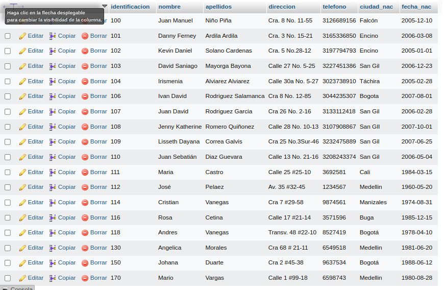
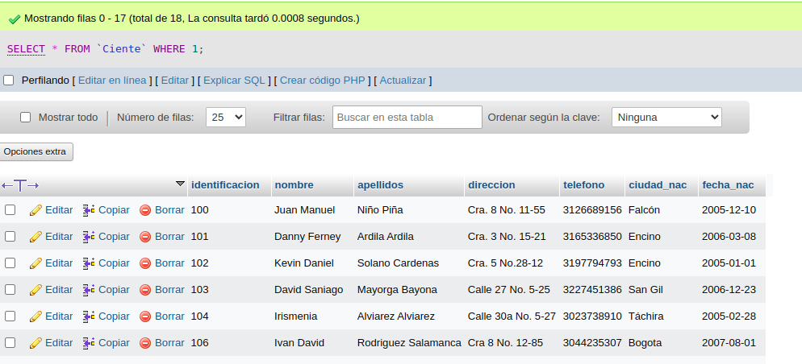
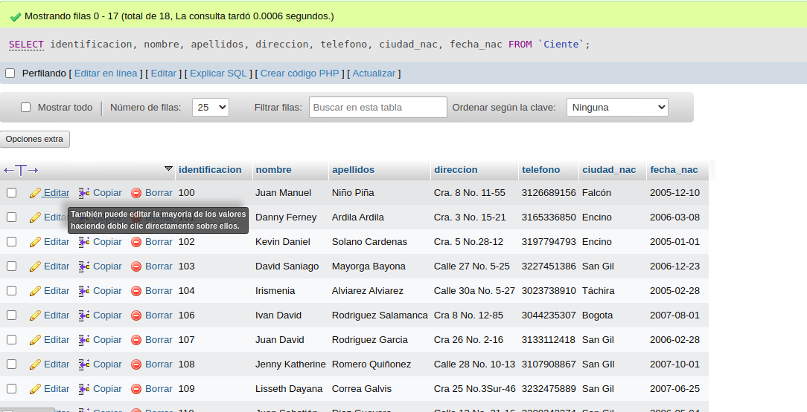
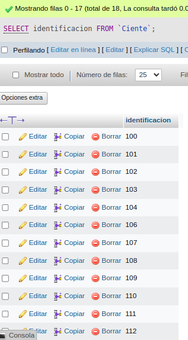

# consultas_1_sql
#  Introduccion a las consultas a una BD usando SQL

## Base de Datos: Ventas
## Tabla Cliente

## Instruccion SELECT
- Permite seleccionar datos de un tabla.
- Su formato es: `SELECT campos_tabla FROM nombre_tabla`

### Consulta No. 1
1. Para visualizar toda la informacion que tiene la tabla Cliente se puede incluir con la instruccion SELECT el caracter **\*** o cada uno de los campos de la tabla

- `SELECT * FROM Cliente`

- `SELECT identificacion, nombre, apellido, direccion, telefono, ciudad_nac, fecha_nac FROM Cliente`

### Consulta No. 2

2. Para visualizar solamente la identificación del Cliente: `SELECT identificacion FROM Cliente`

