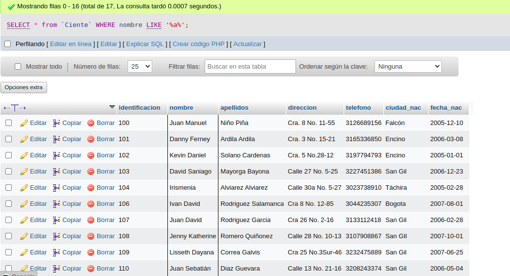
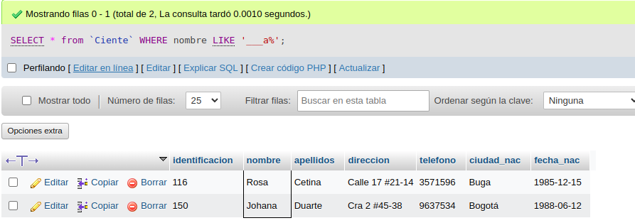
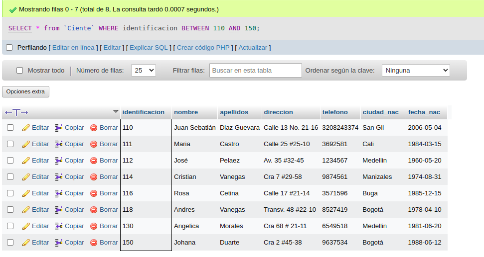
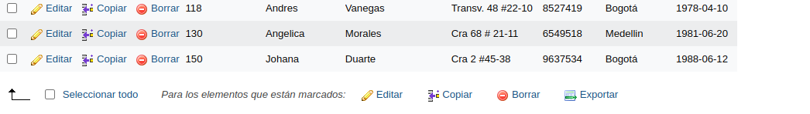
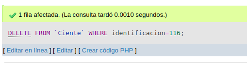
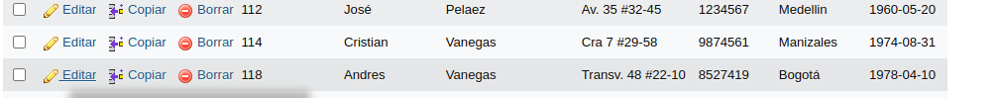
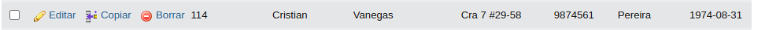
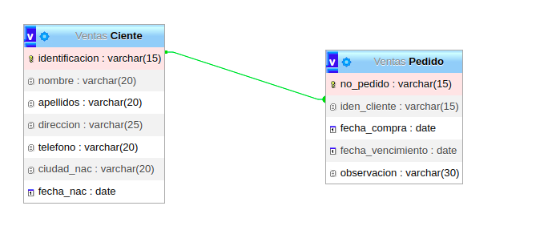
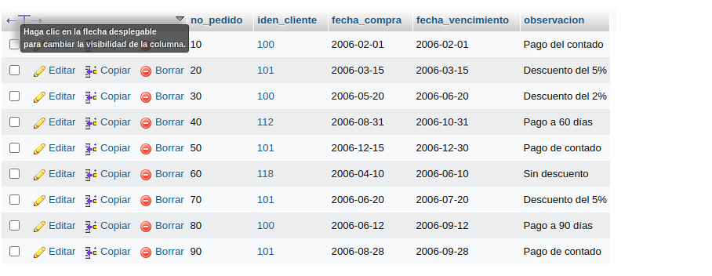

# consultas_1_sql
#  Introduccion a las consultas a una BD usando SQL

## Base de Datos: Ventas
## Tabla Cliente

## Instruccion SELECT
- Permite seleccionar datos de un tabla.
- Su formato es: `SELECT campos_tabla FROM nombre_tabla`

### Consulta No. 1
1. Para visualizar toda la informacion que tiene la tabla Cliente se puede incluir con la instruccion SELECT el caracter **\*** o cada uno de los campos de la tabla

- `SELECT * FROM Cliente`

- `SELECT identificacion, nombre, apellido, direccion, telefono, ciudad_nac, fecha_nac FROM Cliente`

### Consulta No. 2

2. Para visualizar solamente la identificación del Cliente: `SELECT identificacion FROM Cliente`

### Consulta No. 3
3. Si se desea obtener los registros cuya identificacion sea mayor o igual a 150, se debe utiliza la clásula `WHERE` que especifica las condiciones que deben reunir los registros que se van a seleccionar: `SELECT * from Cliente WHERE identificacion>=150`

###  Consulta No. 4
4. Se desea obtener los registros cuyos apellidos sean Vanega o Cetina, se debe utulizar el operador `IN` que especifica los registros que se quieren  visualizar de una tabla.

`SELECT apellidos, nombre from Cliente  WHERE apellidos IN('Vanega', 'Cetina')`

O se puede utilizar el operador OR

`SELECT apellidos, nombre from Clientes WHERE apellidos= 'Vanega' OR apellidos='Cetina'`

###  Consulta No. 5
5. Se desea obtener los registros cuya identificación sea menor de 110 y la ciudad sea Cali, se debe utilizar el operador `AND`

`SELECT * from Cliente WHERE identificacion<=120 AND ciudad='Cali`

###  Consulta No. 6
6. Si se desea obtener los registros cuyos nombres empiezen por la letra 'A', se debe utilizar el operador `LIKE` que utiliza los patrones `%` (todos) y `_` (caracter).

`SELECT from Cliente WHERE nombre LIKE 'A%'`

###  Consulta No. 7
6. Se desea obtener los reigstros cuyos nombres contengan la letra 'a'

`SELECT * from Cliente WHERE nombre LIKE '%a%'`

### Consulta No. 8

8. Se desea obtenere los registros donde la cuarta letra del nombre del cliente seala letra 'a'.

`SELECT * from Cliente WHERE nombre LIKE '___a%'`

### Consulta No. 9

9. Si se desea obtener los registros cuya identificacion  esté entre el intervalo 110 y 150, se debe utilizar la cláusula 'BETWEEN', que sirve para especificar un intervalo de valores.

`SELECT * from Cliente WHERE identificacion BETWEEN 110 AND 150`

## Instruccion DELETE
- Permite borrar todos o un grupo específico de registro de una tabla.
- Su formato es: `DELETE FROM nombre_tabla`

### Eliminación No. 1

1. Eliminar los registros cuya identificacion sea mayor a 150

`DELETE FROM Cliente WHERE identificacion>150`

### Eliminación No. 2

2. Eliminar los registros cuya identificación sea igual a 116

`DELETE FROM Cliente WHERE identificacion=116`

## Instruccion UPDATE
- Permite actualizar un campo de una tabla.
- Su formato es: `UPDATE nombre_tabla SET nombre_campo= valor`

### Actualización no. 1

1. Para actualizar la ciudad de nacimiento de Cristian Vanegas, cuya identificacion es 114

`UPDATE Cliente SET ciudad_nac= 'Pereira' WHERE identificacion=114`

## Creación Tabla Pedido
### Diccionario de Datos
|Campo|Tipo de Dato|Longitud|
|-----|------------|--------|
|***no_ pedido**|varchar|15|
|iden_cliente|varchar|15|
|fecha_compra|date||
|fecha_vencimiento|date||
|observacion|varchar|30|

### Modelo Entidad-Relacion

### Tabla Pedido

